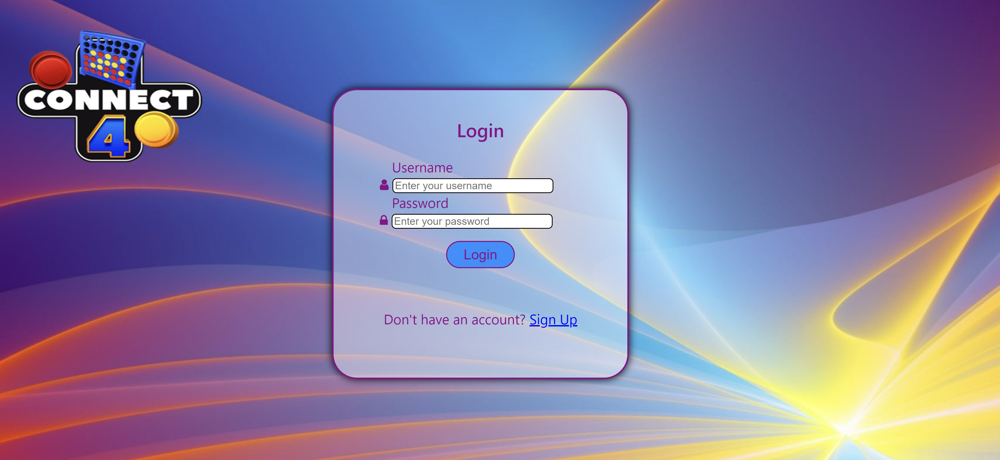

# Web App Connect4 Ai and Multiplayer

This web application allows users to play Connect4 against AI or other players in real-time multiplayer mode. The application features user authentication, account management, game statistics, and more.

## Table of Contents
- [Features](#features)
- [Technologies Used](#technologies-used)
- [Getting Started](#getting-started)
- [Folder Structure](#folder-structure)
- [Backend Development](#backend-development)
- [Frontend Development](#frontend-development)
- [Database](#database)
- [Session Management](#session-management)
- [Socket Communication](#socket-communication)
- [Chat Functionality](#chat-functionality)
- [Email Verification](#email-verification)
- [Game Logic In Frontend](#game-logic-in-frontend)
- [Multiplayer Mode](#multiplayer-mode)
- [Frontend Routing](#frontend-routing)
- [Summary](#summary)
- [Screenshots From The App](#screenshots-from-the-app)
  -[Login Route](#login-route)
  -[Signup Route](#signup-route)
  -[Email Verification Route](#email-verification-route)
  -[Home Route](#home-route)
  -[AI Route](#ai-route)
  -[Multiplayer Route](#multiplayer-route)

## Features

- Player authentication with login and signup forms(cookies for authentication).
- Email verification for account registration.
- Connect4 with AI mode.
- Real-time multiplayer Connect4 mode with chat functionality.
- User account management (sign out, delete account, change mode).
- Game statistics tracking.
- Help and instructions in both game modes.

## Technologies Used

- **Backend:** Node.js, Express.js, PostgreSQL, Nodemailer, Socket.io.
- **Frontend:** React, Axios.
- **Communication:** REST API for general communication, Socket.io for real-time communication.
- **Session Management:** Session data stored for user authentication.
  
## Getting Started

To get started with the Connect4 Multiplayer Web Application, follow these steps:

1. Clone the repository: `git clone https://github.com/vasilisanagno/Web-App-Connect4-Ai-and-Multiplayer.git`
2. Install dependencies: `npm install`
3. Configure your PostgreSQL database and update the database configuration accordingly.
4. Run the application: `npm start`

## Folder Structure

The project has the following backend folder structure:

- `backend`: Contains server-related files.
  - `server.js`: Main server file.
  - `config`: Folder that configurates the connection of the database with the server.
  - `api`: Folder that contains files for the routes and communication with the database.
    - `controllers`: Functions that are called according to the routes.
    - `helpers`: Functions that are useful some of them for the sockets and the game board.
    - `models`: Defines Sequelize models and establishes database associations.
    - `routes`: Defines API routes that exists in the server.
    - `services`: Functions that communicates with the database and makes queries.
    - `socketListeners`: Contains the listeners for sockets/multiplayer-mode.

The project has the following frontend folder structure:

- `frontend`: Contains frontend-related files.
  - `public`: Contains static assets such as images and the `index.html` file.
  - `src`: Contains the source code.
    - `classes`: Classes related to AI.
    - `components`: React components(Javascriopt files) for UI with the CSS files.
      - `hooks`: In some components there is this folder that contains custom hooks for handling the ai and the multiplayer mode.
    - `context`: Hook that have variables that are useful in many components.
    - `helpers`: Helping functions for the UI.
    - `pages`: Pages of the app.
    - `routes`: All different routes across the pages of the app.
    - `style`: CSS style that is general(for all pages) or for one page.
    - `App.js`: Main JavaScript file with routing.

## Backend Development

The backend is structured using Node.js and Express.js. Routes are organized in the `routes` folder, and data processing is handled by the server. Sequelize is used for database operations.

## Frontend Development

he frontend is developed using React. Components are organized in the `components` folder, styles are in the `style` folder and inside the `components` folder for each component, AI-related classes are in the `classes` folder and all the above that were analyzed previously. Axios is used for making API requests to the backend.

## Database

The database structure includes tables for User, Session, AiGame, GameData, MultiplayerGame, and GameDataM. Associations are defined in `models` folder. There is also a file `Connect4_ER_Diagram.png` that shows the entities and relations of the relational database, this image makes the dependencies between entities clearer.

ER Diagram:

## Session Management

User sessions are managed using cookies for authentication. Session data is stored and associated with user-related information.

## Socket Communication

Socket.io is used for real-time communication between players in multiplayer mode.

## Chat Functionality

Real-time chat functionality is implemented in the multiplayer mode using Socket.io.

## Email Verification

Email verification is implemented for enhanced account security during registration.

## Game Logic In Frontend

The game logic is implemented in the classes folder `GameData.js` file, handling moves, checking for winners, and managing game state and `AiModule.js` file contains the logic for the ai.

## Multiplayer Mode

The multiplayer mode allows players to join game rooms, make moves, and communicate in real-time. Socket.io facilitates real-time updates. In the multiplayer mode also is useful and the file `GameDataBackend.js` which contains approximately the same code.

## Frontend Routing

The routing in the application is managed by the `App.js` file. It handles navigation between different components based on the selected route.

## Summary

Initially there is a login form and a signup form and the player will be able to connect or register with his data in the main part of the website (in registration there is verification for the email where a link is sent to the email of the user to be verified his account). There are two buttons, one for connect4 with ai and the other for connect4 with multiplayer. If you click on the player's name, 2 options will appear (sign out, delete account) or 3 options, 1 more option (change mode, where it exits the ai mode or the multiplayer mode and returns to the main part of the website). There is a database in the backend development where users are stored, the information of the games they have played and more (such as sessions). Finally there is statistics and help in both modes, and in the multiplayer there is also chat between the 2 players playing.

## Screenshots From The App

### Login Route

### Signup Route

### Email Verification Route

  

### Home Route

### AI Route

  

  

  

  

  

  

  

  

### Multiplayer Route

  

  

#### Game winner without a player's time running out

  

  

  

  

  

#### Game winner having run out a player's time

  

  

  

  

  

